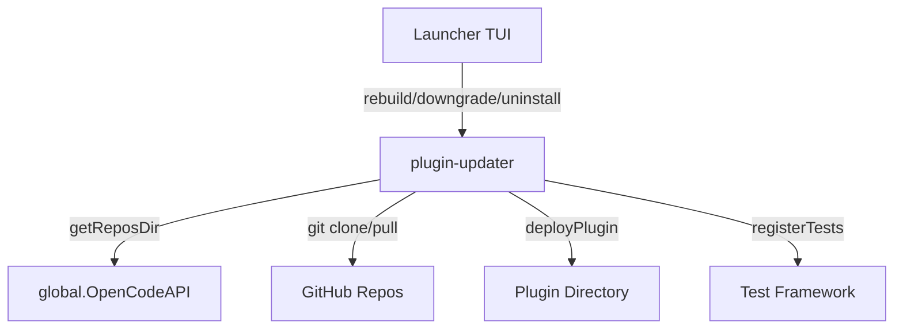

# plugin-updater

Plugin lifecycle manager for OpenCode and Claude Code launchers. Handles install, update, rebuild, downgrade, and uninstall operations for all plugins.

## Architecture

## API

| Method | Description |
|---|---|
| `rebuild(pluginItem)` | Pull latest and redeploy |
| `downgrade(pluginItem, commitHash)` | Checkout specific commit |
| `disable(pluginItem)` | Cleanup on disable |
| `uninstall(pluginItem)` | Remove repo and deployed files |
| `registerTests(testApi)` | Register sync verification tests |

## License

MIT
